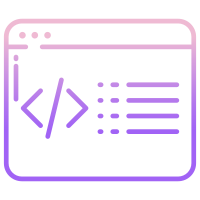

<h3 align="center"> Angular Dev Pack</h3>

<h3 align="center"><i>A collection of super useful extensions for Angular development.</i></h3>

<strong> Extensions in this pack:</strong>

- Auto Rename Tag - Automatically rename paired HTML/XML tag, same as Visual Studio IDE does.
- Better Comments - Create more human-friendly comments in your code.
- GitLens - Quickly glimpse into whom, why, and when a line or code block was changed and more.
- ESLint - Integrates ESLint into VS Code.
- ErrorLens - Show errors in the gutter.
- Prettier - Code formatter.

 
**Happy coding!**